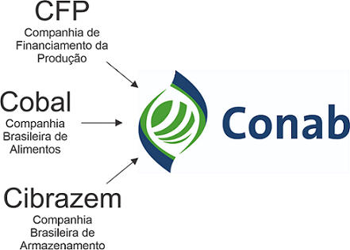
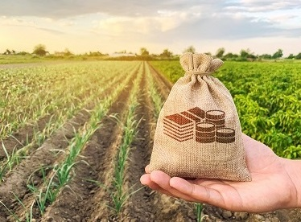
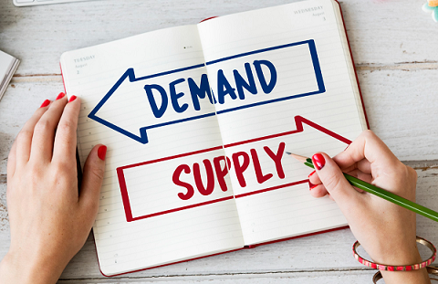
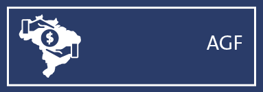

```{r setup, include=FALSE}
knitr::opts_chunk$set(echo = FALSE)
library(tidyr)
library(dplyr)
library(readr)
library(foreach)
library(ggplot2)
library(knitr)
library(kableExtra)
library(DT)
library(stringr)

```

## Política de Garantia de Preços Mínimos - PGPM
- **Origem:** década de 40 (comissão -> companhia)
- Mecanismo específico de política de rendas para agropecuária
  
<div class="columns-2">
  
    
    
    
Segundo Bacha, _a política de rendas constitui-se em uma série de regulamentações que restringem a produção e a comercialização de produtos, bem como o uso dos fatores de produção, determina valores mínimos ou máximos para pagamento pelo uso desses fatores ou produtos elaborados em uma economia._
</div>
## Política de Garantia de Preços Mínimos - PGPM

A PGPM é uma política de apoio aos produtores rurais em que o Governo Federal define um preço mínimo de referência para os produtos agrícolas, visando a execução de medidas que garantam uma rentabilidade mínima da produção, não caracterizando a imposição de preço ao mercado.
  
- Quando intervir no mercado?
  - **Preço de Mercado < Preço Mínimo** 
  
<div class="centered">
  
</div>

## Política de Garantia de Preços Mínimos - PGPM
### Objetivos
<div class="columns-2">
 
- Evitar a grande oscilação de preços dos principais produtos agrícolas.
- Diminuir oscilações na renda dos produtores rurais, assegurando-lhes uma remuneração mínima.
- Balizar a oferta de alimentos, incentivando a produção.
- Assegurar o abastecimento interno de alimentos.
  
 
</div>
## Política de Garantia de Preços Mínimos para os Produtos da Socio biodiversidade (PGPM-Bio) {.smaller}

- Garante um preço mínimo para 17 produtos extrativistas que ajudam na conservação dos biomas brasileiros:
  - açaí, andiroba, babaçu, baru, borracha extrativa, buriti, cacau extrativo, castanha-do-brasil, juçara, macaúba, mangaba, murumuru, pequi, piaçava, pinhão, pirarucu de manejo e umbu.
- objetiva fomentar a proteção ao meio ambiente, contribuir com a redução do desmatamento, como forma de minimizar os efeitos das mudanças climáticas, garantido, inclusive, renda às populações que possuem formas próprias de organização social, que ocupam e usam territórios e recursos naturais como condição para sua reprodução cultural, social, religiosa, ancestral e econômica, utilizando conhecimentos, inovações e práticas gerados e transmitidos pela tradição.
- **Subvenção Direta a Produtos Extrativistas (SDPE)** que consiste no pagamento de um bônus, quando os extrativistas comprovam a venda de produto extrativo por preço inferior ao mínimo fixado pelo Governo Federal.

## Dinâmica da PGPM
<div class="centered">
  
</div>
  
1. Atualização do preço mínimo em cada safra: análise de proposta e aprovação pelo Conselho Monetário Nacional.
1. Publicação do preço mínimo pelo MAPA.
1. Normatização para operacionalização das ações de intervenção (Manual de Operações Conab - MOC).
1. Acompanhamento de mercado, escolha e execução dos Instrumentos de Política Agrícola.

## Preço Mínimo – Base Legal

**Lei nº 8.171, de 17 de janeiro de 1991:** dispõe sobre a política agrícola.

- "Art. 33. \
  - §2° A garantia de preços mínimos far-se-á através de financiamento da comercialização e da aquisição dos produtos agrícolas amparados.\
  - §3° Os alimentos considerados básicos terão tratamento privilegiado para efeito de preço mínimo.” (Leite, arroz, feijão...)
  
**Lei nº 8.427**, de 27 de maio 1992: dispõe sobre a concessão de subvenção econômica para equalização de preços.

## Preço Mínimo – Base Legal

**Decreto – Lei nº 79, de 19 de dezembro de 1966:** institui normas para a fixação do PM e execução das operações de financiamento e aquisições de produtos agropecuários.

- “Art.1º A União garantirá os preços dos produtos das atividades agrícola, pecuária ou extrativa, que forem fixados de acordo com este Decreto-lei.”\
- “Art.5º Os preços mínimos básicos serão definidos pelo Conselho Monetário Nacional-CMN, levando em conta os diversos **fatores que influem nas cotações dos mercados, interno e externo, e os custos de produção**, com base em proposta encaminhada ao Ministério da Fazenda pelo Ministério da Agricultura, Pecuária e Abastecimento-MAPA.”

## Dados de Produção Agrícola (IBGE) {.smaller}

```{r Dados IBGE, echo=FALSE, message=FALSE, warning=FALSE, cache=TRUE}
# Acessar dados diretamente
url_dados <- paste("https://sidra.ibge.gov.br/geratabela?format=br.csv&name=",
                   "tabela5457.csv&terr=N&rank=-&query=t/5457/n3/all/u/y/v/214,215",
                   "/p/last%2017/c782/allxt/l/,v,t%2Bp%2Bc782", sep = "")
# Arquivo local > comente a linha abaixo para acessar dados diretamente do IBGE
url_dados <- "Dados/tabela5457.csv"
dados_ibge <- read_csv2(url_dados, skip = 2, col_types = list(Ano = col_integer()))
colnames(dados_ibge) <- c("UF", "ANO", "PRODUTO", "QTD", "VALOR")
dados_ibge <- filter(dados_ibge, QTD != "-" & QTD != "...", UF != "Guanabara")
dados_ibge$QTD <- as.numeric(dados_ibge$QTD)
dados_ibge <- dados_ibge[order(dados_ibge$UF),]
dados_ibge$PRODUTO[str_detect(dados_ibge$PRODUTO, "Algodão")] <- "Algodão (em caroço)"
dados_ibge$PRODUTO[str_detect(dados_ibge$PRODUTO, "Café")] <- "Café (em grão)"
dados_ibge <- dados_ibge%>%group_by(UF, ANO, PRODUTO)%>%
  summarise(QTD = sum(QTD, na.rm = T))
uf <- read_csv2("Dados/UF.csv")
uf <- rename(uf, UF = NO_UF)
dados_ibge <- left_join(dados_ibge, uf)
# dados_ibge <- rename(dados_ibge, SG_UF = UF)
# dados_ibge <- rename(dados_ibge, UF = NO_UF)
# Quantidade em toneladas para 1000 toneladas
dados_ibge$QTD <- dados_ibge$QTD / 1000
```

### 2005 a 2012\
(Em 1000 toneladas)

```{r echo=FALSE}
tabela <- filter(dados_ibge[, -c(5:7)], ANO > 2004 & ANO < 2013) %>% 
  pivot_wider(names_from = ANO, values_from = QTD, names_sort = T) 
datatable(tabela, options = list(pageLength = 10, dom = 'tip'))
```

## Dados de Produção Agrícola (IBGE) {.smaller}

### 2013 a 2020\
(Em 1000 toneladas)
```{r echo=FALSE}
tabela <- filter(dados_ibge[, -c(5:7)], ANO > 2012) %>% 
  pivot_wider(names_from = ANO, values_from = QTD, names_sort = T) 
datatable(tabela, options = list(pageLength = 10, dom = 'tip'))
```

## Execução e Instrumentos {.smaller}

### **CONAB**
<div class="columns-2">  
- **AGF** - Aquisição do Governo Federal
- **PEP** - Prêmio para o Escoamento de Produto
- **PEPRO** - Prêmio Equalizador Pago ao Produtor
- **COV** - Contrato de Opção de Venda Público
- **VEP** - Venda de Produtos Agropecuários dos Estoques Públicos

### **INSTITUIÇÕES FINANCEIRAS**
- **FEPM** - Financiamento para Estocagem de Produtos Agropecuários integrantes da Política de Garantia de Preços Mínimos
- **FEE** - Financiamento Especial para Estocagem de Produtos Agropecuários
- **FGPP** - Financiamento para Garantia de Preços ao Produtor
\


</div>

## Aquisição do Governo Federal - AGF
<div class="centered">

  
</div>
  \
**O que é:** aquisição direta de produtos da pauta da PGPM. 

**Execução:** operada quando o preço de mercado estiver abaixo do mínimo fixado.  

**Beneficiários:** produtores rurais e/ou suas cooperativas.  

**Limites:** da produção, das normas e de recursos.  

**Como deve estar o produto:** limpo, seco, nos padrões e depositado em armazém credenciado
Condicionada ao repasse pelo Tesouro Nacional dos recursos para a operacionalização das aquisições.

```{r Dados Conab, message=FALSE, warning=FALSE, cache=TRUE, include=FALSE}
# Dados obtidos no endereço https://www.gov.br/agricultura/pt-br/assuntos/politica-agricola/todas-publicacoes-de-politica-agricola/apoio-a-comercializacao/ano-civil-apoio-a-comercializacao-2003-2020-janeiro-20-pdf
# Arquivo em formato PDF covertido pada CSV e padronizado
# Valores em 1000 toneladas

dados_conab <- read_csv2("Dados/MAPA_2002-2020.csv")
# Ajustar produtos e acordo com IBGE
p <- sort(unique(dados_conab$PRODUTO))
b <- c("Algodão (em caroço)", "Arroz (em casca)", "Borracha (látex coagulado)",
       "Café (em grão)", "Farinha de Mandioca", "Fécula de Mandioca", 
       "Feijão (em grão)", "Laranja", "Leite", "Mandioca", "Milho (em grão)", 
       "Sisal ou agave (fibra)", "Soja (em grão)", "Sorgo (em grão)", 
       "Trigo (em grão)", "Uva")
for(i in 1:length(p)) {
  dados_conab$PRODUTO[dados_conab$PRODUTO == p[i]] <- b[i]
}
uf <- read_csv2("Dados/UF.csv")
uf <- rename(uf, UF = SG_UF)
dados_conab <- left_join(dados_conab, uf)
dados_conab <- rename(dados_conab, SG_UF = UF)
dados_conab <- rename(dados_conab, UF = NO_UF)
```
## Dados AGF (MAPA/CONAB) {.smaller}

### 2005 a 2012\
(Em 1000 toneladas)
```{r echo=FALSE}
tabela <- filter(dados_conab[, -c(3,6,8)], ANO >= 2005 & ANO <= 2010 & MODALIDADE == "AGF")
tabela <- tabela[,-2] %>% pivot_wider(names_from = ANO, values_from = QTD, names_sort = T) 
datatable(tabela, options = list(pageLength = 10, dom = 'tip'))
```
## Dados AGF (MAPA/CONAB) {.smaller}

### 2013 a 2020\
(Em 1000 toneladas)
```{r echo=FALSE}
tabela <- filter(dados_conab[, -c(3,6,8)], ANO >= 2011 & MODALIDADE == "AGF") 
tabela <- tabela[,-2] %>% pivot_wider(names_from = ANO, values_from = QTD, names_sort = T) 
datatable(tabela, options = list(pageLength = 10, dom = 'tip'))
```

## Participação AGF/Produção  {.smaller}

```{r include=FALSE}
# Cálculo de participação AGF
prod_agf <- left_join(dados_ibge%>%rename(QTD_PROD = QTD), 
                      dados_conab%>%filter(MODALIDADE == "AGF")%>%rename(QTD_AGF = QTD))%>%
  group_by(NO_REGIAO, ANO, PRODUTO)%>%
  summarise(QTD_AGF = sum(QTD_AGF, na.rm = T), 
            QTD_PROD = sum(QTD_PROD, na.rm = T))
prod_agf$AGF_PART <- prod_agf$QTD_AGF / prod_agf$QTD_PROD *100
prod_agf <- filter(prod_agf, !is.na(AGF_PART) & AGF_PART > 0)
```

### 2005 a 2010\
(% da produção)
```{r echo=FALSE}
tabela <- filter(prod_agf[,-c(4:5)], ANO >= 2005 & ANO <= 2010)%>%
  pivot_wider(names_from = ANO, values_from = AGF_PART, names_sort = T)
datatable(tabela, class = "compact", options = list(pageLength = 10, dom = 'tip'))%>%
  formatRound(columns=c(3:8), digits=2)
```
## Participação AGF/Produção  {.smaller}

### 2011 a 2020\
(% da produção)
```{r echo=FALSE}
tabela <- filter(prod_agf[,-c(4:5)], ANO >= 2011 & ANO <= 2020)%>%
  pivot_wider(names_from = ANO, values_from = AGF_PART, names_sort = T)
datatable(tabela, class = "compact", options = list(pageLength = 10, dom = 'tip'))%>%
  formatRound(columns=c(3:7), digits=2)
```

```{r include=FALSE}
# Cálculo de participação AGF Total por Região
prod_agf <- left_join(dados_ibge%>%rename(QTD_PROD = QTD), 
                      dados_conab%>%filter(MODALIDADE == "AGF")%>%rename(QTD_AGF = QTD))%>%
  group_by(NO_REGIAO, ANO)%>%
  summarise(QTD_AGF = sum(QTD_AGF, na.rm = T), 
            QTD_PROD = sum(QTD_PROD, na.rm = T))
prod_agf$AGF_PART <- prod_agf$QTD_AGF / prod_agf$QTD_PROD *100
prod_agf <- filter(prod_agf, !is.na(AGF_PART) & AGF_PART > 0)
```
## Participação AGF/Produção  {.smaller}

### 2005 a 2020\
(% da produção)
```{r echo=FALSE}
tabela <- filter(prod_agf[,-c(3:4)], ANO >= 2005 & ANO <= 2020)%>%
  pivot_wider(names_from = ANO, values_from = AGF_PART, names_sort = T)
datatable(tabela, class = "compact", options = list(pageLength = 10, dom = 'ti'))%>%
  formatRound(columns=c(2:12), digits=2)
```

```{r eval=FALSE, include=FALSE}
tabela <- filter(prod_agf[,-c(3:4)], ANO >= 2011 & ANO <= 2020)%>%
  pivot_wider(names_from = ANO, values_from = AGF_PART, names_sort = T)
datatable(tabela, class = "compact", options = list(pageLength = 10, dom = 'ti'))%>%
  formatRound(columns=c(2:6), digits=2)
```

## Prêmio para o Escoamento de Produto – PEP

**O que é:** É uma subvenção econômica, para escoamento de produto do local de produção, para o de consumo, concedida àqueles que se disponham a adquirir o produto indicado pelo Governo Federal, diretamente do produtor rural e/ou cooperativa, pelo valor do preço mínimo fixado. 

_Esse instrumento é lançado quando o preço de mercado de um determinado produto está abaixo do Preço Mínimo ou do valor de referência._

**Seleção do beneficiário:** através de leilão público em bolsas de cereais/mercadorias.

**Obrigação:** pagar o preço mínimo e escoar o produto, recebendo o bônus para tal.

**Operação com leite em 2014: R$ 14 milhões - 170 mil toneladas.**

## Dados PEP (MAPA/CONAB) {.smaller}

### 2005 a 2012\
(Em 1000 toneladas)
```{r echo=FALSE}
tabela <- filter(dados_conab[, -c(3,6,8)], ANO >= 2005 & ANO <= 2010 & MODALIDADE == "PEP")
tabela <- tabela[,-2] %>% pivot_wider(names_from = ANO, values_from = QTD, names_sort = T) 
datatable(tabela, options = list(pageLength = 10, dom = 'tip'))
```
## Dados PEP (MAPA/CONAB) {.smaller}

### 2013 a 2020\
(Em 1000 toneladas)
```{r echo=FALSE}
tabela <- filter(dados_conab[, -c(3,6,8)], ANO >= 2011 & MODALIDADE == "PEP") 
tabela <- tabela[,-2] %>% pivot_wider(names_from = ANO, values_from = QTD, names_sort = T) 
datatable(tabela, options = list(pageLength = 10, dom = 'tip'))
```

## Participação PEP/Produção  {.smaller}

```{r include=FALSE}
# Cálculo de participação PEP
prod_agf <- left_join(dados_ibge%>%rename(QTD_PROD = QTD), 
                      dados_conab%>%filter(MODALIDADE == "PEP")%>%rename(QTD_AGF = QTD))%>%
  group_by(NO_REGIAO, ANO, PRODUTO)%>%
  summarise(QTD_AGF = sum(QTD_AGF, na.rm = T), 
            QTD_PROD = sum(QTD_PROD, na.rm = T))
prod_agf$AGF_PART <- prod_agf$QTD_AGF / prod_agf$QTD_PROD *100
prod_agf <- filter(prod_agf, !is.na(AGF_PART) & AGF_PART > 0)
```

### 2005 a 2010\
(% da produção)
```{r echo=FALSE}
tabela <- filter(prod_agf[,-c(4:5)], ANO >= 2005 & ANO <= 2010)%>%
  pivot_wider(names_from = ANO, values_from = AGF_PART, names_sort = T)
datatable(tabela, class = "compact", options = list(pageLength = 10, dom = 'tip'))%>%
  formatRound(columns=c(3:8), digits=2)
```
## Participação PEP/Produção  {.smaller}

### 2011 a 2020\
(% da produção)
```{r echo=FALSE}
tabela <- filter(prod_agf[,-c(4:5)], ANO >= 2011 & ANO <= 2020)%>%
  pivot_wider(names_from = ANO, values_from = AGF_PART, names_sort = T)
datatable(tabela, class = "compact", options = list(pageLength = 10, dom = 'tip'))%>%
  formatRound(columns=c(3:7), digits=2)
```

## Participação PEP/Produção por Região  {.smaller}

```{r include=FALSE}
# Calculo de participação PEP Total por Região
prod_agf <- left_join(dados_ibge%>%rename(QTD_PROD = QTD), 
                      dados_conab%>%filter(MODALIDADE == "PEP")%>%rename(QTD_PEP = QTD))%>%
  group_by(NO_REGIAO, ANO)%>%
  summarise(QTD_PEP = sum(QTD_PEP, na.rm = T), 
            QTD_PROD = sum(QTD_PROD, na.rm = T))
prod_agf$PEP_PART <- prod_agf$QTD_PEP / prod_agf$QTD_PROD *100
prod_agf <- filter(prod_agf, !is.na(PEP_PART) & PEP_PART > 0)
```

### 2005 a 2020\
(% da produção)
```{r echo=FALSE}
tabela <- filter(prod_agf[,-c(3:4)], ANO >= 2005 & ANO <= 2020)%>%
  pivot_wider(names_from = ANO, values_from = PEP_PART, names_sort = T)
datatable(tabela, options = list(pageLength = 10, dom = 'ti'))%>%
  formatRound(columns=c(2:12), digits=2)
```

```{r eval=FALSE, include=FALSE}
tabela <- filter(prod_agf[,-c(3:4)], ANO >= 2011 & ANO <= 2020)%>%
  pivot_wider(names_from = ANO, values_from = PEP_PART, names_sort = T)
datatable(tabela, class = "compact", options = list(pageLength = 10, dom = 'ti'))%>%
  formatRound(columns=c(2:6), digits=2)
```

## Prêmio Equalizador Pago ao Produtor – PEPRO

**O que é:** subvenção econômica para escoamento de produto do local de produção para o de consumo.

**Lançamento:** quando o preço de mercado estiver abaixo do mínimo.

**Beneficiários:** aqueles que se disponham a adquirir o produto indicado pelo Governo Federal, diretamente do produtor rural e/ou cooperativa.

**Seleção do beneficiário:** através de leilão público em bolsas de cereais/mercadorias.

**Obrigação:** pagar o preço mínimo e escoar o produto, recebendo o bônus para tal.

## Dados PEPRO (MAPA/CONAB) {.smaller}

### 2005 a 2012\
(Em 1000 toneladas)
```{r echo=FALSE}
tabela <- filter(dados_conab[, -c(3,6,8)], ANO >= 2005 & ANO <= 2012 & MODALIDADE == "PEPRO")
tabela <- tabela[,-2] %>% pivot_wider(names_from = ANO, values_from = QTD, names_sort = T) 
datatable(tabela, options = list(pageLength = 10, dom = 'tip'))
```
## Dados PEPRO (MAPA/CONAB) {.smaller}

### 2013 a 2020\
(Em 1000 toneladas)
```{r echo=FALSE}
tabela <- filter(dados_conab[, -c(3,6,8)], ANO >= 2013 & MODALIDADE == "PEPRO") 
tabela <- tabela[,-2] %>% pivot_wider(names_from = ANO, values_from = QTD, names_sort = T) 
datatable(tabela, options = list(pageLength = 10, dom = 'tip'))
```

```{r include=FALSE}
# Cálculo de participação PEPRO
prod_agf <- left_join(dados_ibge%>%rename(QTD_PROD = QTD), 
                      dados_conab%>%filter(MODALIDADE == "PEPRO")%>%rename(QTD_PEPRO = QTD))%>%
  group_by(NO_REGIAO, ANO, PRODUTO)%>%
  summarise(QTD_PEPRO = sum(QTD_PEPRO, na.rm = T), 
            QTD_PROD = sum(QTD_PROD, na.rm = T))
prod_agf$PART <- prod_agf$QTD_PEPRO / prod_agf$QTD_PROD *100
prod_agf <- filter(prod_agf, !is.na(PART) & PART > 0)
```
## Participação PEPRO/Produção  {.smaller}

### 2005 a 2010\
(% da produção)
```{r echo=FALSE}
tabela <- filter(prod_agf[,-c(4:5)], ANO >= 2005 & ANO <= 2012)%>%
  pivot_wider(names_from = ANO, values_from = PART, names_sort = T)
datatable(tabela, class = "compact", options = list(pageLength = 10, dom = 'tip'))%>%
  formatRound(columns=c(3:9), digits=2)
```
## Participação PEPRO/Produção  {.smaller}

### 2011 a 2020\
(% da produção)
```{r echo=FALSE}
tabela <- filter(prod_agf[,-c(4:5)], ANO >= 2013 & ANO <= 2020)%>%
  pivot_wider(names_from = ANO, values_from = PART, names_sort = T)
datatable(tabela, class = "compact", options = list(pageLength = 10, dom = 'tip'))%>%
  formatRound(columns=c(3:9), digits=2)
```

## Participação PEPRO/Produção por Região  {.smaller}

```{r include=FALSE}
# Cálculo de participação PEPRO Total por Região
prod_agf <- left_join(dados_ibge%>%rename(QTD_PROD = QTD), 
                      dados_conab%>%filter(MODALIDADE == "PEPRO")%>%rename(QTD_PEPRO = QTD))%>%
  group_by(NO_REGIAO, ANO)%>%
  summarise(QTD_PEPRO = sum(QTD_PEPRO, na.rm = T), 
            QTD_PROD = sum(QTD_PROD, na.rm = T))
prod_agf$PART <- prod_agf$QTD_PEPRO / prod_agf$QTD_PROD *100
prod_agf <- filter(prod_agf, !is.na(PART) & PART > 0)
```

### 2005 a 2020\
(% da produção)
```{r echo=FALSE}
tabela <- filter(prod_agf[,-c(3:4)], ANO >= 2005 & ANO <= 2012)%>%
  pivot_wider(names_from = ANO, values_from = PART, names_sort = T)
datatable(tabela, class = "compact", options = list(pageLength = 10, dom = 'ti'))%>%
  formatRound(columns=c(2:8), digits=2)
```

```{r echo=FALSE}
tabela <- filter(prod_agf[,-c(3:4)], ANO >= 2013 & ANO <= 2020)%>%
  pivot_wider(names_from = ANO, values_from = PART, names_sort = T)
datatable(tabela, class = "compact", options = list(pageLength = 10, dom = 'ti'))%>%
  formatRound(columns=c(2:8), digits=2)
```

## Contrato de Opção de Venda Público – COV
<div class="centered">

</div>
O Contrato de Opção de Venda Público é uma modalidade de **seguro de preços** que dá ao produtor rural e/ou sua cooperativa o direito – mas não a obrigação – de vender seu produto para o governo, numa data futura, a um preço previamente fixado e faz parte da Política de Garantia de Preços Mínimos do Governo Federal (PGPM). 

_Essa modalidade é lançada quando o mercado está abaixo ou com tendência a alcançar valor menor que o preço mínimo e o governo tem interesse de sinalizar preço futuro para o mercado._

## Dados COV (MAPA/CONAB) {.smaller}

### 2005 a 2020\
(Em 1000 toneladas)
```{r echo=FALSE}
tabela <- filter(dados_conab[, -c(3,6,8)], ANO >= 2005 & ANO <= 2020 & MODALIDADE == "OPÇÃO PÚBLICA")
tabela <- tabela[,-2] %>% pivot_wider(names_from = ANO, values_from = QTD, names_sort = T) 
datatable(tabela, options = list(pageLength = 10, dom = 'tip'))
```

## Participação COV/Produção  {.smaller}

```{r include=FALSE}
# Cálculo de participação COV
prod_agf <- left_join(dados_ibge%>%rename(QTD_PROD = QTD), 
                      dados_conab%>%filter(MODALIDADE == "OPÇÃO PÚBLICA")%>%rename(QTD_PEPRO = QTD))%>%
  group_by(NO_REGIAO, ANO, PRODUTO)%>%
  summarise(QTD_PEPRO = sum(QTD_PEPRO, na.rm = T), 
            QTD_PROD = sum(QTD_PROD, na.rm = T))
prod_agf$PART <- prod_agf$QTD_PEPRO / prod_agf$QTD_PROD *100
prod_agf <- filter(prod_agf, !is.na(PART) & PART > 0)
```

### 2005 a 2020\
(% da produção)
```{r echo=FALSE}
tabela <- filter(prod_agf[,-c(4:5)], ANO >= 2005 & ANO <= 2020)%>%
  pivot_wider(names_from = ANO, values_from = PART, names_sort = T)
datatable(tabela, class = "compact", options = list(pageLength = 10, dom = 'tip'))%>%
  formatRound(columns=c(3:10), digits=2)
```

## Participação COV/Produção por Região {.smaller}

```{r include=FALSE}
# Cálculo de participação COV Total por Região
prod_agf <- left_join(dados_ibge%>%rename(QTD_PROD = QTD), 
                      dados_conab%>%filter(MODALIDADE == "OPÇÃO PÚBLICA")%>%rename(QTD_PEPRO = QTD))%>%
  group_by(NO_REGIAO, ANO)%>%
  summarise(QTD_PEPRO = sum(QTD_PEPRO, na.rm = T), 
            QTD_PROD = sum(QTD_PROD, na.rm = T))
prod_agf$PART <- prod_agf$QTD_PEPRO / prod_agf$QTD_PROD *100
prod_agf <- filter(prod_agf, !is.na(PART) & PART > 0)
```

### 2005 a 2020\
(% da produção)
```{r echo=FALSE}
tabela <- filter(prod_agf[,-c(3:4)], ANO >= 2005 & ANO <= 2020)%>%
  pivot_wider(names_from = ANO, values_from = PART, names_sort = T)
datatable(tabela, class = "compact", options = list(pageLength = 10, dom = 'ti'))%>%
  formatRound(columns=c(2:9), digits=2)
```

## Venda de Produtos Agropecuários dos Estoques Públicos – VEP

O VEP é um instrumento voltado para quem se dispõem a adquirir o produto do Governo Federal e promover seu **escoamento para uma região de consumo previamente estabelecida**, mediante recebimento de subvenção.

_A venda dos estoques públicos é realizando quando há necessidade de intervenção no mercado, pelo Governo Federal, para regular preços e abastecer segmentos consumidores por meio de escoamento._

## Financiamento para Estocagem de Produtos Agropecuários integrantes da Política de Garantia de Preços Mínimos – FEPM

**Objetivo:** proporcionar recursos para armazenagem e conservação de produtos para venda futuras em melhores condições de mercado.

**Beneficiários:** produtores rurais (pessoas físicas e pessoas jurídicas), inclusive avicultores de corte e suinocultores independentes (não integrados), suas cooperativas e produtores de sementes registrados no Ministério da Agricultura, Pecuária e Abastecimento.

## Financiamento Especial para Estocagem de Produtos Agropecuários – FEE

**Objetivo:** proporcionar recursos para armazenagem e conservação de produtos para vendas futuras em melhores condições de mercado.

**Beneficiários:** produtores rurais (pessoas físicas e pessoas jurídicas) e suas cooperativas.

## Financiamento para Garantia de Preços ao Produtor – FGPP

**Objetivo:** visa permitir aos produtores rurais a venda de sua produção por valor não inferior ao preço mínimo, para os produtos amparados pela PGPM, ou ao preço de referência fixado para os produtos constantes do MCR.

**Beneficiários:** Cooperativas de Produtores Rurais nas atividades de beneficiamento ou industrialização, beneficiadores, agroindústrias, cerealistas, avicultores de corte e suinocultores independentes (não integrados).

## Links úteis
<center>
#### Sistema IBGE de Recuperação Automática - SIDRA
[Produção Agrícola Municipal](https://sidra.ibge.gov.br/Tabela/5457)

#### Ministério da Agricultura, Pecuária e Abastecimento - MAPA
[Comercialização e Abastecimento](https://www.gov.br/agricultura/pt-br/assuntos/politica-agricola/comercializacao-e-abastecimento)

#### Companhia Nacional de Abastecimento - CONAB
[Instrumentos de Política Agrícola](https://www.conab.gov.br/precos-minimos/instrumentos-de-politica-agricola)\
[Portal de Informações Agropecuárias - Operações de Comercialização](https://portaldeinformacoes.conab.gov.br/operacoes-de-comercializacao.html)\
[Transparência - Gestão dos Estoques Públicos](http://sisdep.conab.gov.br/transparencia_internet/)

#### Baixar Apresentação
<div class="centered">
<br>
[*github.com/profmarcelojesus*](https://github.com/profmarcelojesus/pgpm)
</div>
